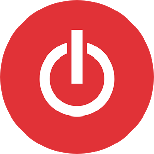

## My Time-Tracking Project
### Final Project for the *Developing Data Products class*
#### Gerardo Durán Martín

---

## Ever wondered how much time you spend on things?
<iframe src=' figure/nvd3plot2-1.html ' scrolling='no' frameBorder='0' seamless class='rChart polycharts ' id=iframe- chartab86d568c30 ></iframe> 

---

## Are you making proress?
<iframe src=' figure/unnamed-chunk-1-1.html ' scrolling='no' frameBorder='0' seamless class='rChart polycharts ' id=iframe- chartab85d7ae336 ></iframe> 

---

## With Toggl and R you can find out!
  

---

## Here's my take!
<a href="https://qger.shinyapps.io/time_tracker">My Time-Tracking Journey</a>
